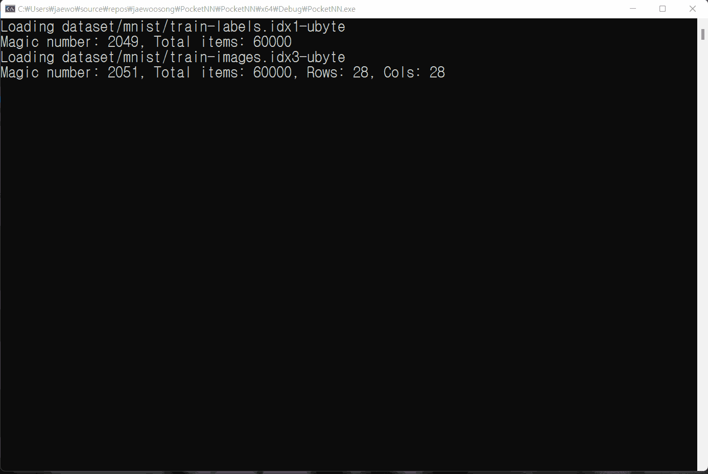

# PocketNN
This is an official, proof-of-concept C++ implementation of the paper [PocketNN: Integer-only Training and Inference of Neural Networks via Direct Feedback Alignment and Pocket Activations in Pure C++](https://arxiv.org/abs/2201.02863). The paper was accepted in [TinyML 2022 Research Symposium](https://www.tinyml.org/event/research-symposium-2022) as a full paper.

## Take a look!
Just run the `Main.cpp` file to see training and testing a PocketNN network with the MNIST dataset! Other sample usages can be found in `pktnn_examples.cpp` file.



## How to Build
There are two directories, `PocketNN_linux` and `PocketNN_windows`, because of slight differences between C++ development environment of Linux and Windows. The algorithm is identical.

### Linux
PocketNN code for Linux is in the `PocketNN_linux` directory. Run the following commands to build on Linux.

```
cd PocketNN_linux
mkdir build
cd build
cmake ..
make
```

The `libcurl` library is required. If it is not on your system, install by following commands:

```
# Ubuntu
sudo apt-get install libcurl4-openssl-dev

# Centos
sudo yum install libcurl-devel

# macOS
brew install curl
```

Then you can run `PocketNN` in the build directory to see the demo.

```
$ ./PocketNN
Loading dataset/mnist/train-labels.idx1-ubyte
Magic number: 2049, Total items: 60000
Loading dataset/mnist/train-images.idx3-ubyte
Magic number: 2051, Total items: 60000, Rows: 28, Cols: 28
Loading dataset/mnist/t10k-labels.idx1-ubyte
Magic number: 2049, Total items: 10000
Loading dataset/mnist/t10k-images.idx3-ubyte
Magic number: 2051, Total items: 10000, Rows: 28, Cols: 28
Loaded train images,60000,Loaded test images,10000
Initial training numCorrect,5923
Initial test numCorrect,980
----- NOW START -----
(CSV format)
Learning Rate Inverse,1000,numTrainSamples,60000,miniBatchSize,20
Training
Epoch,SumLoss,NumCorrect,Accuracy
Initialized DFA!
Initialized DFA!
1,1087826,54475,0.907917
2,623752,57127,0.952117
3,518970,57708,0.9618
Final training numCorrect,57866

Test
Epoch,NumCorrect
1,9495
2,9575
3,9593
Final test numCorrect,9593
Final test accuracy,0.9593
Final learning rate inverse,1000
$
```

### Windows
The `PocketNN_windows` directory contains PocketNN code for Windows. I used Visual Studio 2019 to write the code. Visual Studio solution file is included in the repository to help importing the project.

## Citing PocketNN
TinyML 2022's official citation information will be updated soon. In the meantime, please use the arXiv information as below.

```
@article{song2022pocketnn,
  title={PocketNN: Integer-only Training and Inference of Neural Networks via Direct Feedback Alignment and Pocket Activations in Pure C++},
  author={Song, Jaewoo and Lin, Fangzhen},
  journal={arXiv preprint arXiv:2201.02863},
  year={2022}
}
```

## Presentation video
Please click the image below to watch a youtube video which was recorded at tinyML 2022.

[Youtube link of TinyML 2022: PocketNN Presentation](https://www.youtube.com/watch?v=Gcx-b92iXlI)

[](https://www.youtube.com/watch?v=Gcx-b92iXlI)

## License
PocketNN uses the MIT License. For details, please see the `LICENSE` file.

## Sample datasets
Two sample datasets are copied from their original website.
- MNIST dataset: MNIST dataset is from [the MNIST website](http://yann.lecun.com/exdb/mnist/). The site says "Please refrain from accessing these files from automated scripts with high frequency. Make copies!" So I made the copies and put them in this repository.
- Fashion-MNIST dataset: Fashion-MNIST dataset is from [its github repository](https://github.com/zalandoresearch/fashion-mnist). It follows the MIT License which allows copy and distribution.

